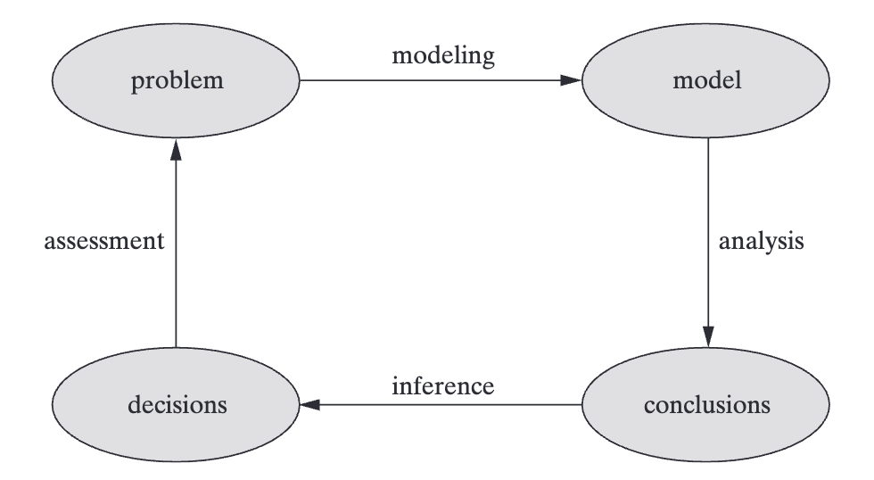

# Introduction to Operations Research

Operations research deals with decision problems by formulating and analyzing **mathematical models**, representations of the key features of a problem.

## The Operations Research Process

1. **Modeling** – Define variables and quantify relationships.
2. **Analysis** – Use mathematical tools to explore the model.
3. **Inference** – Translate model conclusions into real-world decisions.
4. **Assessment** – Evaluate decisions and refine the model if necessary.

## Modeling Focus Areas

When building an OR model, focus on three fundamental components:

### 1. **Decisions - choices the decision maker has to make**

**Example (MM’s inventory):**
- When to reorder (reorder point)
- How much to reorder (order quantity)

---

### 2. **Constraints - limitations or rules that restrict decision options**

**Example:**
- Order quantity must be ≥ 100 carats
- Both reorder point and order quantity must be ≥ 0

---

### 3. **Objectives - goal or criterion used to judge decision quality**

**Example:**
- Minimize total cost, including:
  - Holding cost
  - Replenishment cost
  - Lost-sales cost

---
